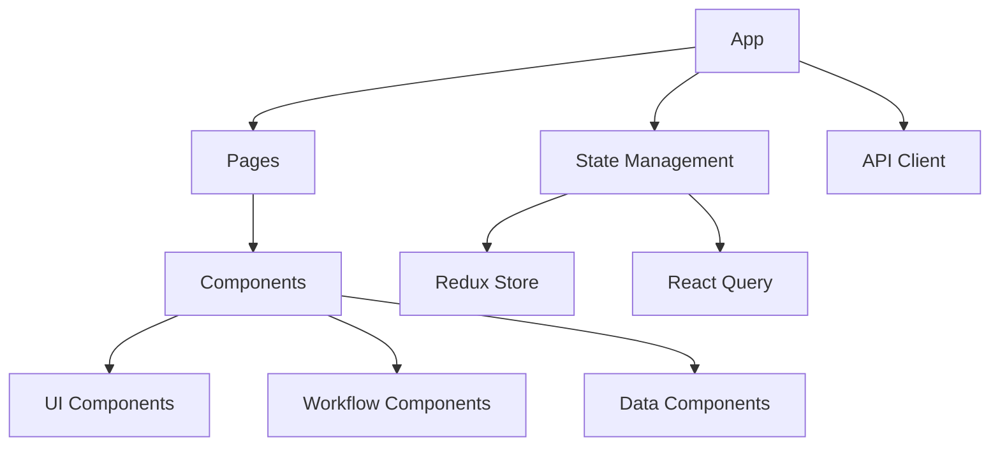
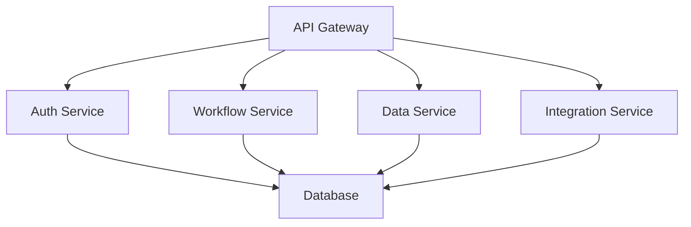
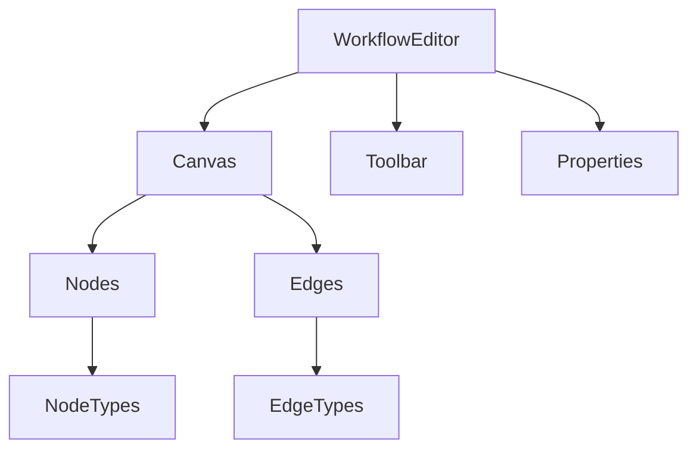
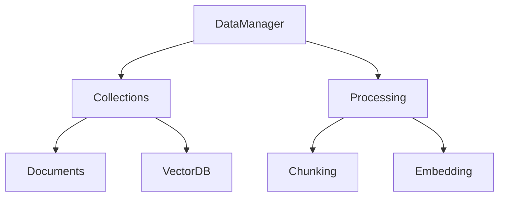
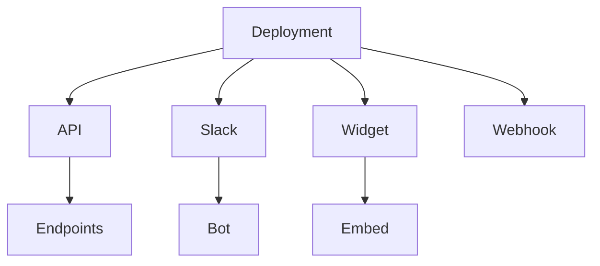

# System Patterns: ScoutOS Revived Vision

## Architecture Overview

### Frontend Architecture

### Backend Architecture

## Design Patterns

### 1. Component Patterns
- Atomic Design for UI components
- Container/Presenter pattern for complex components
- Custom hooks for shared logic
- Context for theme and auth state

### 2. State Management
- Redux for global state
- React Query for server state
- Context for UI state
- Local state for component-specific data

### 3. Data Flow
- Unidirectional data flow
- Immutable state updates
- Normalized data structure
- Optimistic updates

### 4. API Integration
- REST API for CRUD operations
- WebSocket for real-time updates
- GraphQL for complex queries
- tRPC for type-safe APIs

### 5. Authentication
- JWT for stateless auth
- OAuth for third-party login
- Role-based access control
- Session management

### 6. Error Handling
- Global error boundary
- API error handling
- Form validation
- Toast notifications

## Component Relationships

### 1. Workflow Editor

### 2. Data Management

### 3. Deployment

## Technical Decisions

### 1. Frontend Framework
- Next.js for SSR and routing
- React for UI components
- TypeScript for type safety
- Tailwind CSS for styling

### 2. State Management
- Redux Toolkit for global state
- React Query for server state
- Zustand for simple state
- Context for theme/auth

### 3. UI Components
- Shadcn/ui for base components
- Radix UI for accessibility
- Framer Motion for animations
- React Flow for workflow editor

### 4. Backend Services
- Node.js for runtime
- Express for API framework
- PostgreSQL for relational data
- Vector DB for embeddings

### 5. AI Integration
- LangChain for workflow
- OpenAI for GPT models
- Anthropic for Claude
- HuggingFace for open models

### 6. Deployment
- Vercel for frontend
- AWS for backend
- Docker for containers
- GitHub Actions for CI/CD

## Security Patterns

### 1. Authentication
- JWT tokens
- OAuth 2.0
- MFA support
- Session management

### 2. Authorization
- Role-based access
- Resource-based permissions
- API key management
- Team permissions

### 3. Data Security
- End-to-end encryption
- Secure API keys
- Data isolation
- GDPR compliance

### 4. API Security
- Rate limiting
- CORS configuration
- Input validation
- Error handling

## Performance Patterns

### 1. Frontend
- Code splitting
- Lazy loading
- Memoization
- Virtual scrolling

### 2. Backend
- Caching
- Connection pooling
- Query optimization
- Load balancing

### 3. Data
- Indexing
- Pagination
- Filtering
- Aggregation

### 4. AI
- Batch processing
- Model optimization
- Response streaming
- Cost optimization 